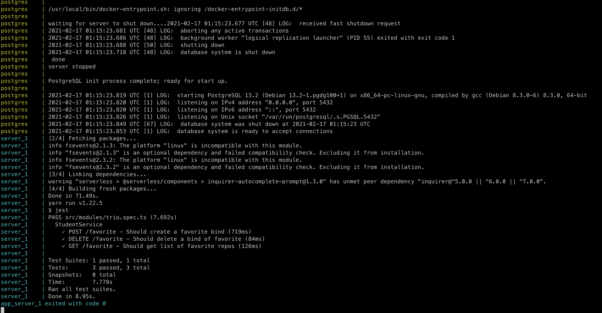
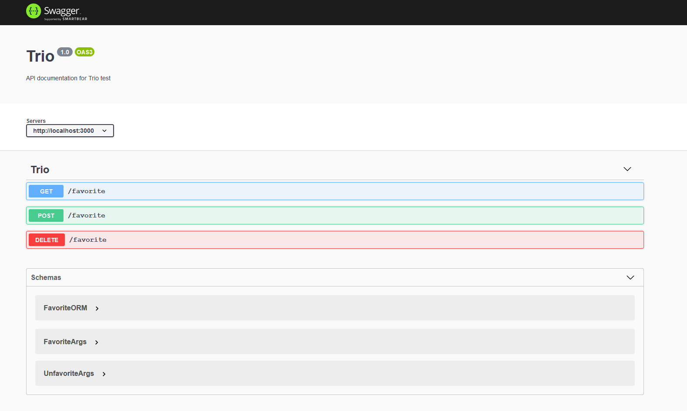
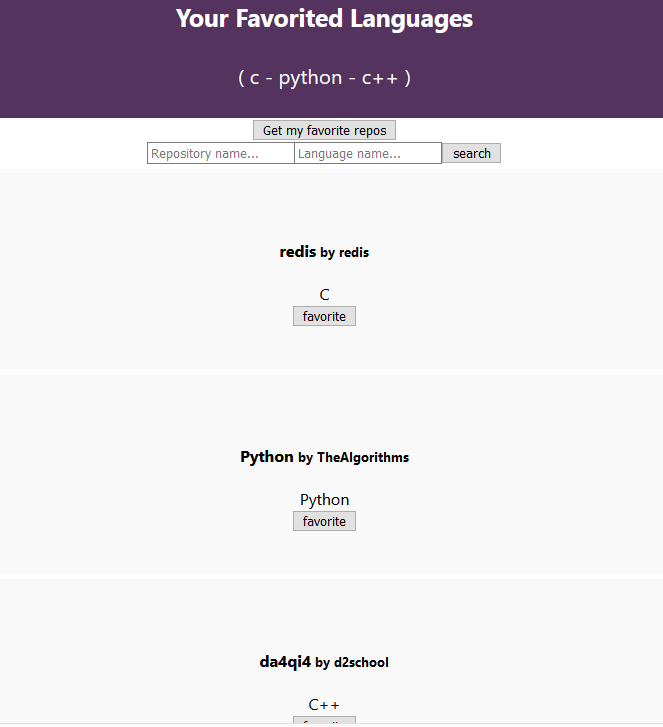
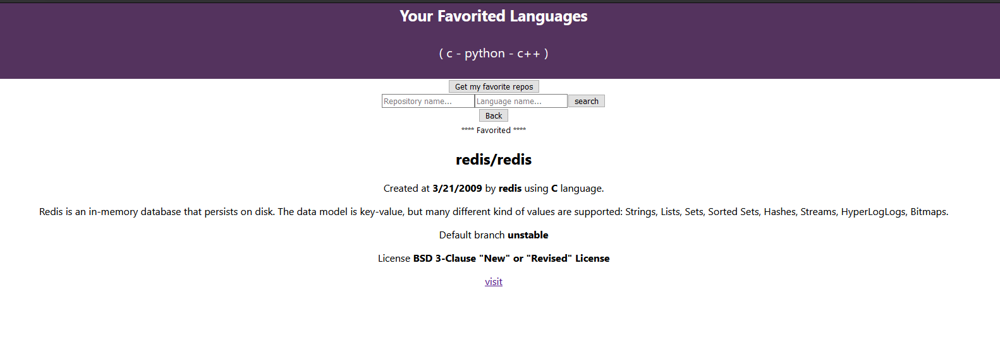

# TrioTest

Hi guys, I'm Caio Cozza.

Don't mind my ugly frontend since my experience is 100% backend based (C, C++, Python, Node).

I've made the backend using Typescript and with a framework called Nest.js.
The frontend is pretty basic and it's written with React. Besides my very basic knowledge of frontend I could read the docs and implement something.

Check out my github and my medium page :)
- https://www.linkedin.com/in/caio-cozza-660bb0129
- https://github.com/caiocozza
- https://caiocozza-art.medium.com/

### How to run the application?
```
docker-compose -f run.docker-compose.yml up --build
```

### How to run the backend tests?
```
docker-compose -f test.docker-compose.yml up --build
```

### How to access the online docs (Swagger) ?
Go to http://localhost:3000/docs

## Evidences

### Tests



### Swagger


### frontend

