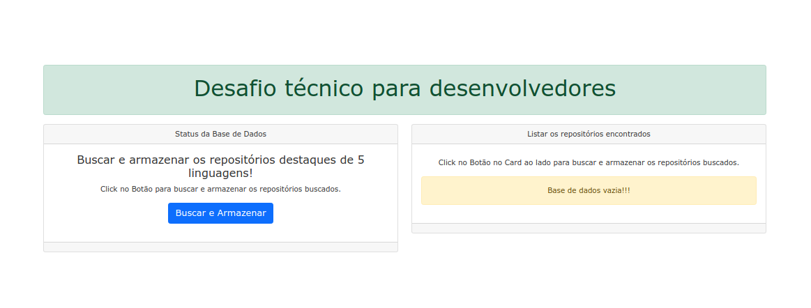
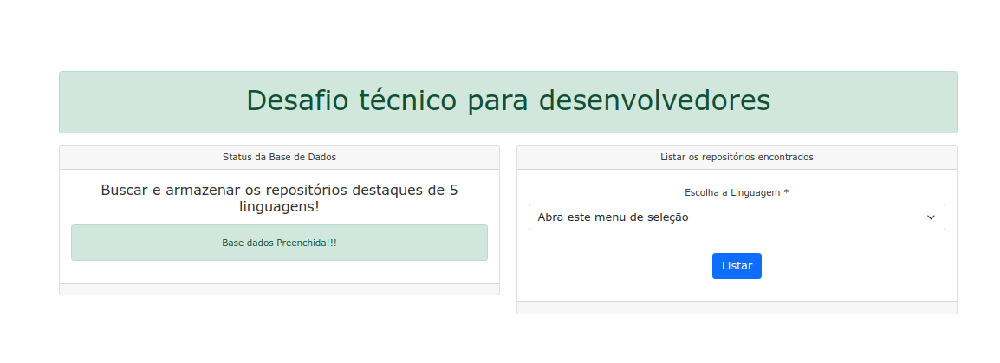
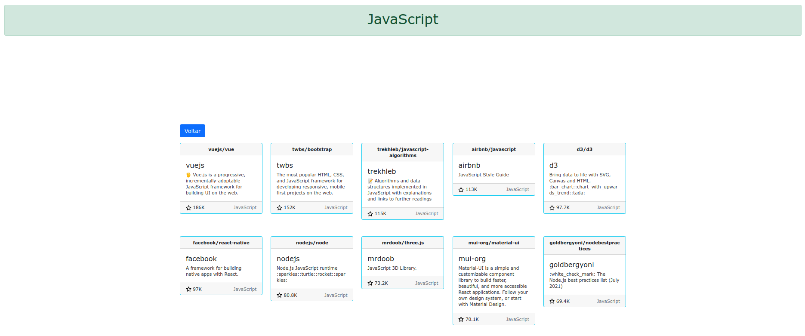

<p align="center">
  

  
  
  <a href="https://github.com/CarlosGrimm/dev_hiring_challenge/commits/master">
    
  </a>
    
   
   <a href="https://github.com/CarlosGrimm/dev_hiring_challenge/stargazers">
    
  </a>
</p>
<h1 align="center">
    Desafio técnico para desenvolvedores
</h1>

<h4 align="center"> 
	🚧  dev-hiring-challenge Concluído 🚧
</h4>

<p align="center">
 <a href="#-sobre-o-projeto">Sobre</a> •
 <a href="#-funcionalidades">Funcionalidades</a> •
 <a href="#-layout">Layout</a> • 
 <a href="#-como-executar-o-projeto">Como executar</a> • 
 <a href="#-tecnologias">Tecnologias</a> • 
 <a href="#user-content--licença">Licença</a>
</p>


## 💻 Sobre o projeto

Construa uma nova aplicação, utilizando o framework de sua preferência (Ruby on Rails, Elixir Phoenix, Python Django ou Flask, NodeJS Sails, Java Spring, ASP.NET ou outro), a qual deverá conectar na API do GitHub e disponibilizar as seguintes funcionalidades:

- Botão para buscar e armazenar os repositórios destaques de 5 linguagens à sua escolha;
- Listar os repositórios encontrados;
- Visualizar os detalhes de cada repositório.

---

## ⚙️ Funcionalidades

- [x] Deve ser uma aplicação totalmente nova;
- [x] A solução deve estar em um repositório público do GitHub;
- [x] A aplicação deve armazenar as informações encontradas;
- [x] Utilizar PostgreSQL, MySQL ou SQL Server;
- [x] O deploy deve ser realizado, preferencialmente, no Heroku, AWS ou no Azure;
- [x] A aplicação precisa ter testes automatizados;
- [x] Preferenciamente dockerizar a aplicação;
- [x] Por favor atualizar o readme da aplicação com passo a passo com instrução para subir o ambiente.
- [x] Quando terminar, faça um Pull Request neste repo e avise-nos por email.
---

## 🎨 Layout

Antes de criar um repositório:

<p align="center">
  
</p>

Após criar um repositório e armazenar as informações encontradas:

<p align="center">
  
</p>
Listar os repositórios encontrados e Visualizar os detalhes de cada repositório:

<p align="center">
  
</p>

---

## 🚀 Como executar o projeto

Feito deploy no Heroku e está disponível em: https://fast-wave-28398.herokuapp.com/.

Além disto, é possível executar a aplicação seguindo os passos abaixo.

### Pré-requisitos

Antes de começar, você vai precisar ter instalado em sua máquina as seguintes ferramentas:
[Git](https://git-scm.com), [Docker](https://nodejs.org/en/), [Docker Compose](https://docs.docker.com/compose/install/).
Além disto é bom ter um editor para trabalhar com o código como [VSCode](https://code.visualstudio.com/)

#### 🎲 Rodando a aplicação

```bash

# Clone este repositório
$ git clone git@github.com:CarlosGrimm/dev_hiring_challenge.git

# Acesse a pasta do projeto no terminal/cmd
$ cd dev_hiring_challenge

# Execute a aplicação em modo de desenvolvimento
$ docker-compose up

# Pare a apliação pois a parte web estará funcionando mas sem conexão com o banco de dados
$ Ctrl+c

# Crie ou Limpe a base de dados
$ docker-compose run web rake db:drop db:create db:migrate

# Execute novamente a aplicação em modo de desenvolvimento
$ docker-compose up

# O servidor inciará na porta:3000
Acesse http://localhost:3000 ou http://127.0.0.1:3000/

# Caso deseje executar o teste automatizado, há somente um teste(se a API do GitHub está acessível)
$ docker-compose run web rake spec


```

---

## 🛠 Tecnologias

As seguintes ferramentas foram usadas na construção do projeto:

#### **Linguagem e docker**

-   **[Docker](https://www.docker.com/)**
-   **[Ruby 2.5.9](https://www.ruby-lang.org/en/news/2021/04/05/ruby-2-5-9-released/)**
-   **[Rails 5.2.6](https://rubyonrails.org/)**
-   **[Postgresql](https://www.postgresql.org/)**

#### **Gems e outras bibliotecas utilizadas** 

-   **[Bootstrap](https://getbootstrap.com/)**
-   **[RSpec](https://rspec.info/)**

---


## 📝 Licença

Este projeto esta sobe a licença [MIT](./LICENSE).

Feito com ❤️ por Carlos Grimm 👋🏽 [Entre em contato!](https://www.linkedin.com/in/CarlosGrimm/)

---
