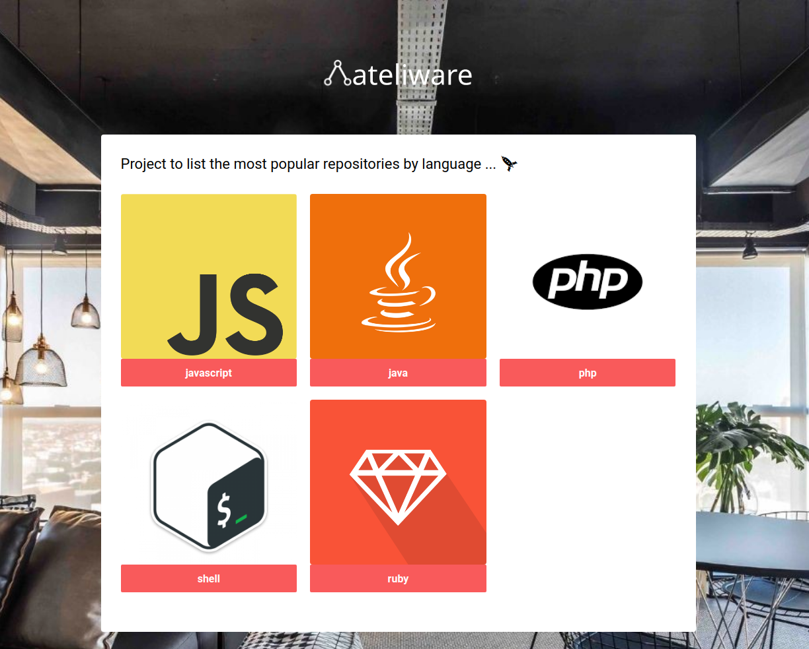
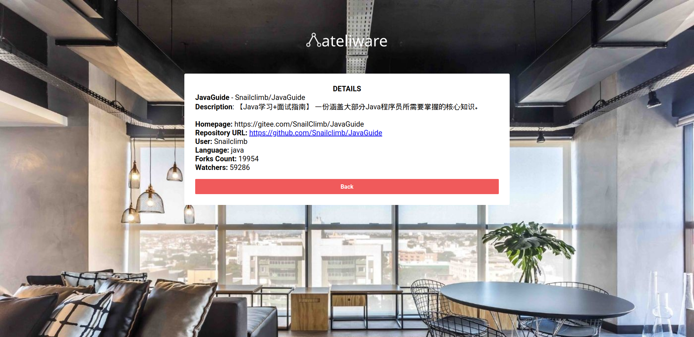

# Desafio técnico para desenvolvedores

Construa uma nova aplicação, utilizando o framework de sua preferência (Rails, ASP.NET, Phoenix, etc), a qual deverá conectar na API do GitHub e disponibilizar as seguintes funcionalidades:

- Botão para buscar e armazenar os repositórios destaques de 5 linguagens à sua escolha;
- Listar os repositórios encontrados;
- Visualizar os detalhes de cada repositório.

Alguns requisitos:

- Deve ser uma aplicação totalmente nova;
- A solução deve estar em um repositório público do GitHub;
- A aplicação deve armazenar as informações encontradas;
- Utilizar Postgres, MySQL ou SQL Server;
- O deploy deve ser realizado, preferencialmente, no Heroku ou no Azure;
- A aplicação precisa ter testes automatizados.

Quando terminar, faça um Pull Request neste repo e avise-nos por email.

**IMPORTANTE:** se você não conseguir finalizar o teste, por favor nos diga o motivo e descreva quais foram as suas dificuldades. Claro que você também pode sugerir uma outra abordagem para avaliarmos seus skills técnicos, mas é com você para vender seu peixe, mostrar-nos do que é capaz.

# Resolução do desafio by Smith Júnior

Eu dividi a arquitetura da aplicação em dois repositórios públicos no github, segue os links [ateliware-front](https://github.com/smithjunior/ateliware-frontend) e [ateliware-backend](https://github.com/smithjunior/ateliware-backend).

## Backend

Na parte do **BACKEND** eu utilizei o framework [AdonisJS](https://adonisjs.com/), sendo honesto foi uma experimentação neste desafio, e os resultados alcaçados até aqui foram bem satisfatorios.

Para a publicação eu utilizei o serviço do Heroku.

A aplicação está disponível no [LINK](https://ateliware-backend.herokuapp.com/)

## Frontend

No **FRONTEND** utilizei o ReactJs para a construção das interfaces.

O deploy eu utilizei como serviço de publicação o Heroku.

A aplicação está disponível no [LINK](https://ateliware-frontend.herokuapp.com/).

Segue as imagens das páginas criadas.

1. Home apresentando as linguagens que podem ser pesquisadas.

2. Lista dos repositórios mais populares pela linguagem selecionada

3. Detalhes do repositórios selecionado

