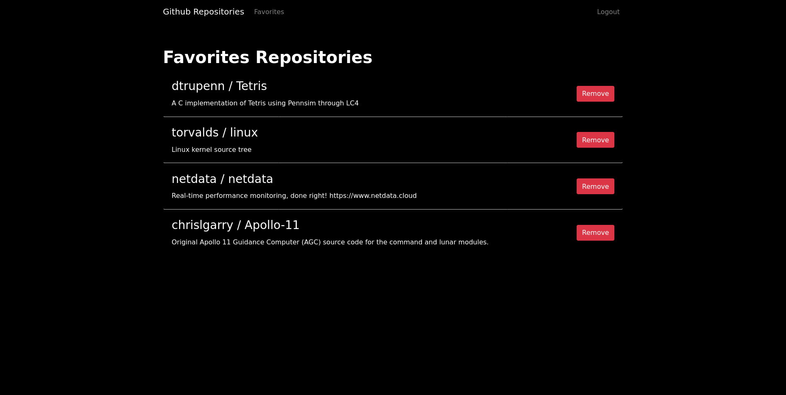

# Github Repositories

Permite procurar os top 10 repositórios das linguagens disponíveis.

- [Instalação](#instalação)
  - [Rails](#rails)
  - [Instalando as dependências do projeto](#instalando-as-dependências-do-projeto)
  - [Inicializando o banco de dados](#inicializando-o-banco-de-dados)
- [Rodando o projeto](#rodando-o-projeto)
- [Demo](#demo)
- [Screenshots](#screenshots)
  - [Modelo entidade relacionamento](#modelo-entidade-relacionamento)
  - [Sem usuário logado - listagem](#sem-usuário-logado---listagem)
  - [Sem usuário logado - listagem da linguagem C](#sem-usuário-logado---listagem-da-linguagem-c)
  - [Com usuário logado - listagem da linguagem C](#com-usuário-logado---listagem-da-linguagem-c)
  - [Com usuário logado - favoritos](#com-usuário-logado---favoritos)
- [Rodando os testes](#rodando-os-testes)
- [Rodando o linter](#rodando-o-linter)


# Instalação
Para instalar é necessário:
- `ruby 2.7.2`
- `PostgreSQL`

## Rails
- `$ gem install rails`

## Instalando as dependências do projeto
```bash
$ git clone git@github.com:losoliveirasilva/dev-hiring-challenge.git
$ cd dev-hiring-challenge
$ bundle install
```
## Inicializando o banco de dados
- `$ rails db:create db:migrate`
- `$ rails db:seed` _opcional_

# Rodando o projeto
- `$ rails s`
- `$ yarn start`

# Rodando os testes
- `$ rspec spec/`

# Rodando o linter
- `$ rubocop`

# Demo
Acessar: https://challenge-github-search.herokuapp.com/

A demo já possui um usuário, mas você pode criar um novo se desejar:
- email: example@example.com
- senha: 123123

# Screenshots

# Modelo entidade relacionamento


## Sem usuário logado - listagem


## Sem usuário logado - listagem da linguagem C


## Com usuário logado - listagem da linguagem C


## Com usuário logado - favoritos

