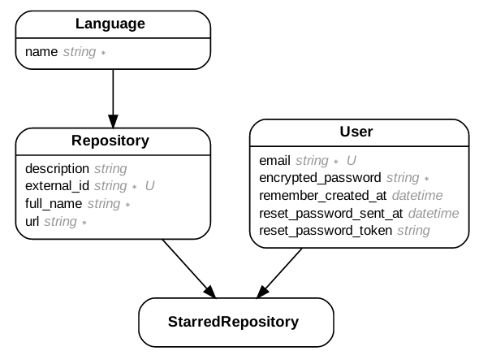

# Github Repositories

Permite procurar os top 10 repositórios das linguagens disponíveis.

# Instalação
Para instalar é necessário:
- `ruby 2.7.2`
- `PostgreSQL`

## Rails
- `$ gem install rails`

## Instalando as dependências do projeto
```bash
$ git clone git@github.com:losoliveirasilva/dev-hiring-challenge.git
$ cd dev-hiring-challenge
$ bundle install
```
## Inicializando o banco de dados
- `rails db:create db:migrate`
- `rails db:seed` _opcional_

# Rodando o projeto
- `rails s`
- `yarn start`

# Demo
Acessar: https://challenge-github-search.herokuapp.com/

A demo já possui um usuário, mas você pode criar um novo se desejar:
- email: example@example.com
- senha: 123123

# Screenshots

# Modelo entidade relacionamento


## Without user - blank list


## Without user - C list


## With user - C list


## With user - Favorites

